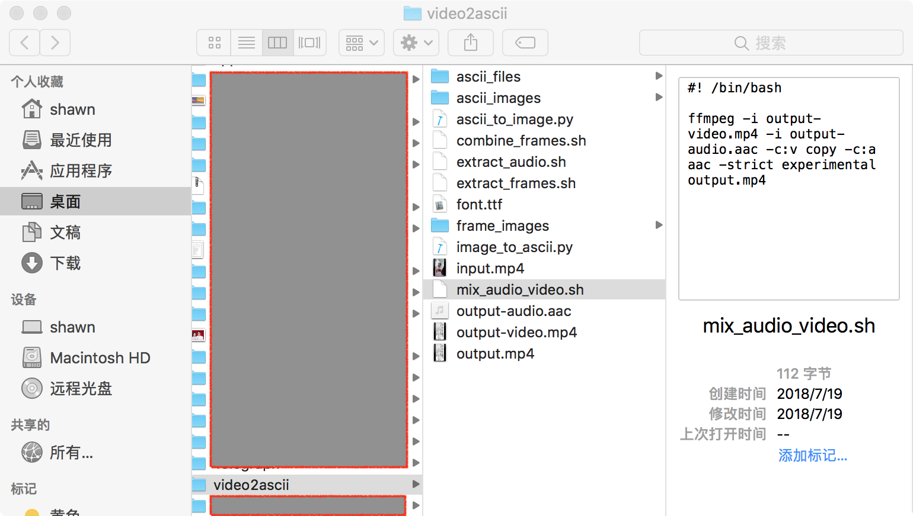
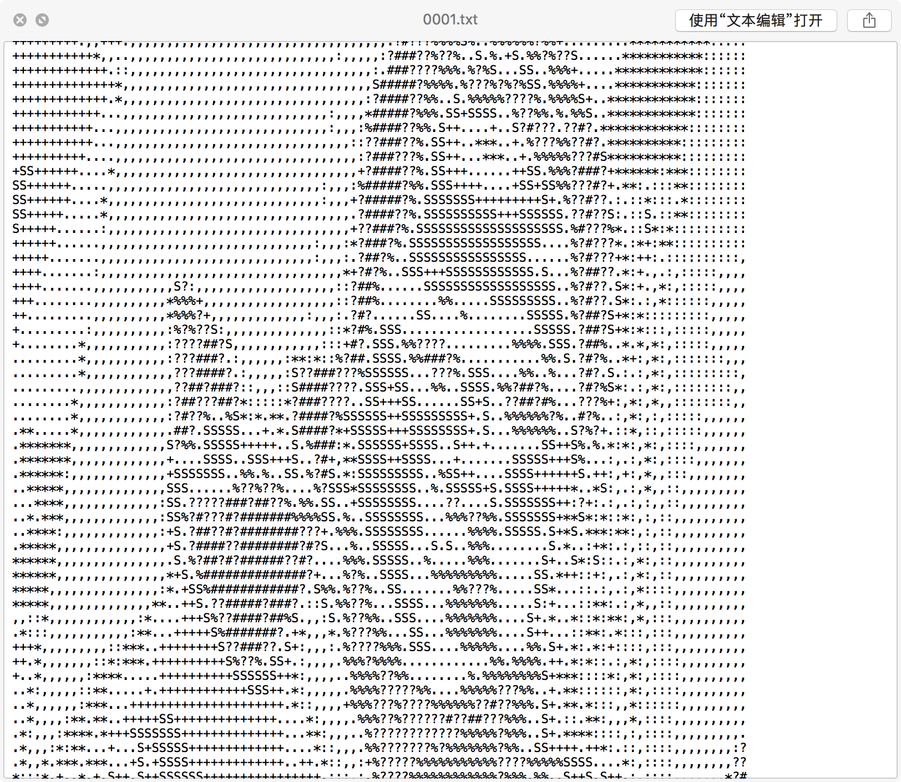

# video2ascii
Transfer video to ascii animation using ffmpeg.

## Screenshot





## Prerequisite
- Have [ffmpeg](https://www.ffmpeg.org/) installed. It's recommend using homebrew.
- Download a font file for ascii image.
- Basic knowledge about using command line.

## Steps
1. extract audio
```bash
ffmpeg -i input.mp4 -vn -acodec copy output-audio.aac
```

2. extract video frames
```bash
ffmpeg -i input.mp4 %04d.bmp
mkdir frame_images
mv *.bmp frame_images
```

3. generate ascii string for each frame
```bash
mkdir ascii_files
ls frame_images | grep .bmp | xargs -n1 python3 image_to_ascii.py
```

4. generate image frame for each ascii string
```bash
mkdir ascii_images
ls ascii_files | grep .txt | xargs -n1 python3 ascii_to_image.py
```

5. combine frames
```bash
cd ascii_images
ffmpeg -framerate 30 -i %04d.png -c:v libx264 -pix_fmt yuv420p -crf 23 -vf scale=-2:720 output-video.mp4
```

6. mix video and audio
```bash
ffmpeg -i output-video.mp4 -i output-audio.aac -c:v copy -c:a aac -strict experimental output.mp4
```
